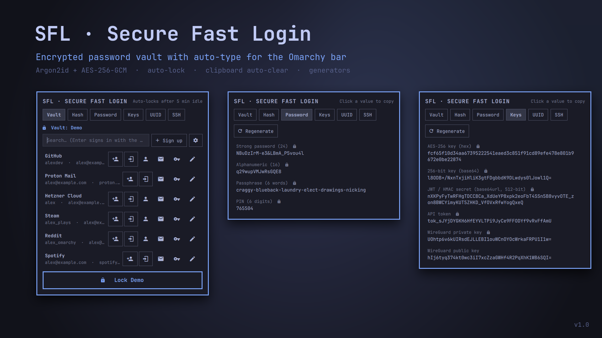
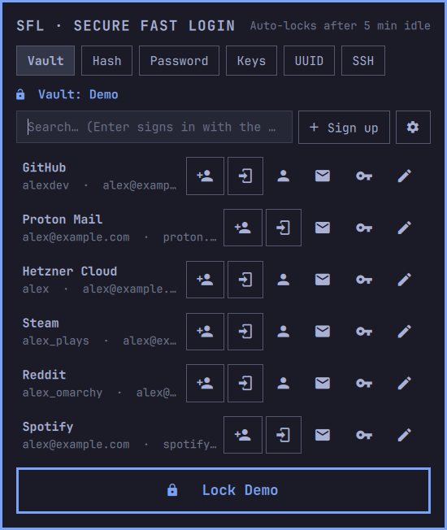
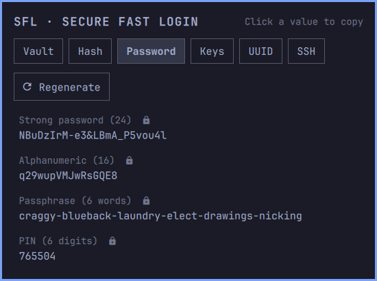
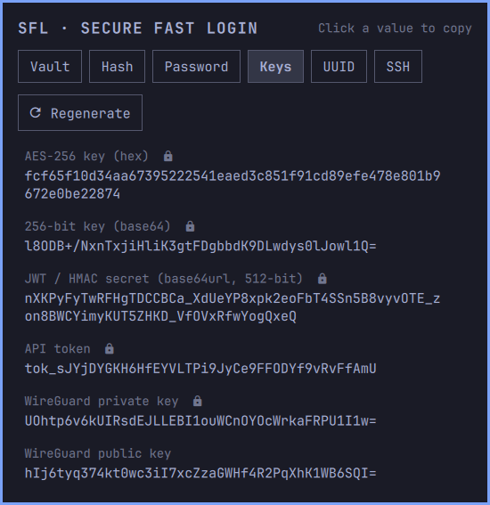

# SFL: Secure Fast Login v1.0 for Omarchy

> An encrypted password vault with auto-type, right in the [Omarchy](https://omarchy.org/) bar.
> Plus one-click generators for passwords, keys, hashes, UUIDs and SSH keypairs.

<p align="center">
  
</p>

---

## Features

- **Password vault**
  - Several vaults, each with its own master password.
  - Search, add, edit and delete logins; usernames and emails are remembered as presets.
  - **Auto-type**: set the order a site asks for its fields once (email, password, Enter…),
    then sign up or sign in with one click. SFL types into the window you came from.
  - Auto-locks after 5 idle minutes.
- **Generators**: strong passwords, alphanumeric, 6-word passphrases, PINs,
  AES-256 / HMAC keys, API tokens, WireGuard keypairs, UUID v4 / v7, Nano IDs,
  ed25519 SSH keypairs.
- **Hashes**: MD5, SHA-1/256/512, SHA3-256, BLAKE2b, bcrypt, sha512crypt,
  Base64, hex, URL-encoding, ROT13.
- **Click to copy**: secrets are kept out of clipboard history and cleared after 30 s.
- **Keyboard friendly**: arrow keys move between controls, `Tab` switches panels, `Esc` backs out.

<p align="center">
  
  
  
</p>

## Install

Dependencies (Arch):

```bash
sudo pacman -S --needed python-cryptography jq wl-clipboard wtype openssl whois cracklib util-linux
```

Then add the plugin and put it in your bar:

```bash
omarchy plugin add https://github.com/foexig/omarchy-sfl.git --enable
```

Optional hotkey (pick any free key), in `~/.config/hypr/bindings.conf`:

```ini
bindd = SUPER SHIFT, P, SFL vault, exec, omarchy shell fabio.crypto toggle
```

Open a panel directly: `omarchy shell fabio.crypto mode <vault|hash|password|keys|uuid|ssh>`.

## Update

```bash
omarchy plugin update fabio.crypto
```

## Remove

```bash
omarchy plugin remove fabio.crypto
```

This removes the plugin but **keeps your vaults** in `~/.local/share/fabio.crypto/`.
Delete that folder too only if you are sure you no longer need any logins in it:

```bash
rm -rf ~/.local/share/fabio.crypto
```

## Security design

- Master password → **Argon2id** (1 GiB, 4 passes) → 256-bit key. Entries are sealed
  with **AES-256-GCM**, a fresh nonce on every save, and the header authenticated so
  the KDF parameters can't be tampered with (they are bounds-checked as well).
- Vaults live in `~/.local/share/fabio.crypto/` (folder `700`, files `600`), written
  atomically. The master password is never stored; only the derived key is held
  while a vault is unlocked.
- Secrets travel over stdin or the environment, never command-line arguments, so they
  don't show up in `ps`.
- Copied secrets use `wl-copy --sensitive` and are cleared after 30 seconds.
- Auto-type refuses terminals and agent windows, and stops if focus moves to another window.
- SFL never changes your Omarchy config; enabling it only adds it to your bar.

Your vault is only as strong as your master password: use 5–6 random words.

> Plugins run unsandboxed. Read the code before trusting it with your passwords;
> it is only a handful of files.

## License

[MIT](LICENSE)
